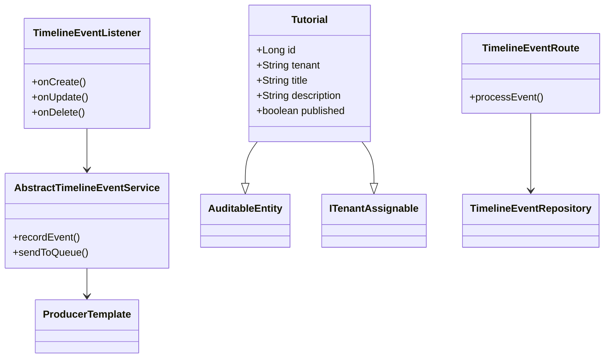

# Entity Change Tracking Solution


A lightweight alternative to Hibernate Envers for tracking entity changes with selective field tracking, multi-tenancy support, and async event processing.

## Features ✨
- **Annotation-driven tracking** (`@TrackChanges`)
- **Change detection** - Only modified fields are captured
- **Multi-tenant support** - Automatic tenant isolation
- **Async event processing** - Using Apache Camel
- **Custom event types** - Beyond basic CRUD operations
- **Minimal overhead** - Low performance impact

## Architecture Overview 🏗️


## Getting Started 🚀

### Prerequisites
- Java 17+
- Spring Boot 3.1+
- Apache Camel 3.20+
- PostgreSQL

### Installation
1. Clone the repository:
```bash
git clone https://github.com/isygo-dev/01-wams-stack.git
cd 01-wams-stack/00-service-stack-demo/02-jpa-patterns/03-timeline-events
```

2. Configure your database in `application.yml`:
```yaml
spring:
  datasource:
    url: jdbc:postgresql://localhost:5432/your_db
    username: your_user
    password: your_password
```

3. Run the application:
```bash
./mvnw spring-boot:run
```

## Usage 📝

### 1. Annotate Your Entity
```java
@Entity
@EntityListeners(TimelineEventListener.class)
public class Tutorial extends AuditableEntity<Long> implements ITenantAssignable {
    
    @TrackChanges
    private String title;
    
    @TrackChanges
    private String description;
    
    // Other fields...
}
```

### 2. Perform CRUD Operations
All changes will be automatically tracked:
```java
// Create
Tutorial tutorial = tutorialRepository.save(new Tutorial(...));

// Update
tutorial.setTitle("New Title");
tutorialRepository.save(tutorial);

// Delete
tutorialRepository.delete(tutorial);
```

### 3. View Timeline Events
```java
List<TimeLineEvent> events = timelineEventRepository
    .findByElementTypeAndElementId("Tutorial", "123");
```

## Comparison with Alternatives ⚖️
| Feature                | This Solution         | Hibernate Envers      | Spring Data Auditing |
|------------------------|-----------------------|----------------------|----------------------|
| Selective Field Tracking | ✅ Yes               | ❌ No                | ❌ No                |
| Change Detection       | ✅ Yes               | ❌ No                | ❌ No                |
| Multi-Tenancy Support  | ✅ Native            | ⚠️ Config Needed     | ⚠️ Manual Handling   |
| Async Processing       | ✅ Yes               | ❌ No                | ❌ No                |
| Custom Event Types     | ✅ Yes               | ❌ No                | ❌ No                |
| Performance Impact     | ⚡ Low               | ⚠️ High              | ⚡ Low               |

## Testing 🧪
Run integration tests with:
```bash
./mvnw test
```

Tests verify:
- Correct event recording for CRUD operations
- Proper change detection
- Tenant isolation
- Async processing

## Contributing 🤝
Contributions are welcome! Please open an issue or submit a pull request.

## License 📄
This project is licensed under the MIT License - see the LICENSE file for details.